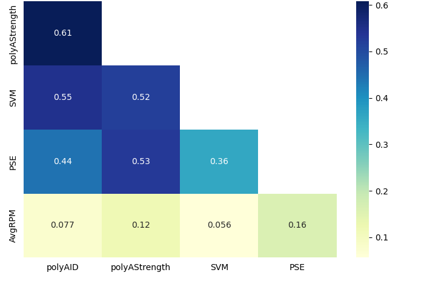

# Alternative Polyadenylation Site Usage Prediction with Deep Learning

 

 

## Table of Contents

I. Introduction

II. Methods

III. Results

IV. Conclusion

V. Technologies

VI. Abbreviation

VII. Acknowledgements

VIII. References

 

## I. Introduction

Alternative polyadenylation has been implicated in association with human diseases.  To further understand the underlying mechanism, the main goal of this study is to use convolutional neural network models PolyAID, PolyAStrength, and APARENT2 to charactize the usage level of polyadenylation sites in the long-read-annotated PolyADB4-LR database.

 

## II. Methods

Models.  PolyAID.  PolyAStrength.  PolyA_SVM.

 

Table 1.  Column Description.  Also see PolyADB4-LR database for more information: https://github.com/wcjohnchen/polyadb4_lr

| Column | Description |
| ---- | ---- |
|Key |Unique identification for PAS (gene symbol : chromosome : strand : position : type). |
|Gene Symbol |Abbreviation for gene name. |
|PasID |PAS identification (chromosome : strand : position). |
|Type |Long-read-TES-supported polyA site category: TR: PAS found in terminal regions, in which the regions are identified as aggregated overlapping 3’-most exon of isoform of each gene by RefSeq TES annotation; UR: upstream regions of TR;  DR: downstream regions of TR. |
|PSE |Percentage of samples which PASs were expressed. |
|AvgRPM |Mean RPM of PAS. |
|mm10_pAid |Conserved sites in mouse genome (mm10). Non-conserved sites are labeled as "nc". |
|NumRefSeq |Number of the PAS reads annotated by RefSeq TESs. |
|NumLENCODE |Number of long-read TESs (from the ENCODE4 PacBio IsoSeq dataset) that were matched to the PAS location. |
|NumLRGETx |Number of long-read TESs (from the GTEx V9 ONT cDNA dataset) that were matched to the PAS location. |
|polyAID |Classification probability for putative PAS within a sequence expected to occur (https://github.com/zhejilab/PolyaModelsHuman). |
|polyAStregth |Score for the usage level of PAS (https://github.com/zhejilab/PolyaModelsHuman). |
|SVM |Predicted PAS probability by support vector machine (polya_svm v1.1: https://exon.apps.wistar.org/polya_svm/). |

 

## III. Results

Figure 1.  Feature correlation of TR PASs.

 

Figure 2.  Cancer-associated genes.

 

Figure 3.  Age-associated gene.

 

Figure 4.  Skin-associated gene.

 

Figure 5.  PAS usage prediction using APARENT2.

## IV. Conclusion

Disease models.

 

## V. Technologies

Bioinformatics, Machine Learning, Deep Learning, Jupyter Notebook, Python R, VS Code, Git, Linux

 

## VI. Abbreviation

PAS: polyA site  

TES: Transcription end site

 

## VII. Acknowledgements

I would like to thank Dr. Bin Tian’s lab for data availability and contribution.

 

## VIII. References

Bogard N, Linder J, Rosenberg AB, and Seelig G. 2019.  A Deep Neural Network for Predicting and Engineering Alternative Polyadenylation. Cell, 178(1):91-106.e23.  doi: 10.1016/j.cell.2019.04.046.

Chen M, Lyu G, Han M, Nie H, Shen T, Chen W, Niu Y, Song Y, Li X, Li H, Chen X, Wang Z, Xia Z, Li W, Tian XL, Ding C, Gu J, Zheng Y, Liu X, Hu J, Wei G, Tao W, and Ni T. 2018.  3' UTR lengthening as a novel mechanism in regulating cellular senescence. Genome Res, 28(3):285-294.  doi: 10.1101/gr.224451.117.

Cheng Y, Miura RM, and Tian B.  2006.  Prediction of mRNA polyadenylation sites by support vector machine.  Bioinformatics, 22(19):2320-5.  doi: 10.1093/bioinformatics/btl394.

Goering R, Engel KL, Gillen AE, Fong N, Bentley DL, and Taliaferro JM.  2021.  LABRAT reveals association of alternative polyadenylation with transcript localization, RNA binding protein expression, transcription speed, and cancer survival. BMC Genomics, 26;22(1):476.  doi: 10.1186/s12864-021-07781-1.

Linder J, Koplik SE, Kundaje A, and Seelig G. 2022.  Deciphering the impact of genetic variation on human polyadenylation using APARENT2. Genome Biol, 23(1):232.  doi: 10.1186/s13059-022-02799-4.

Stroup EK, and Ji Z. 2023. Deep learning of human polyadenylation sites at nucleotide resolution reveals molecular determinants of site usage and relevance in disease. Nature Commun, 14(1):7378:1-17.  doi: 10.1038/s41467-023-43266-3.

Wang R, Nambiar R, Zheng D, and Tian B.  2017.  PolyA_DB 3 catalogs cleavage and polyadenylation sites identified by deep sequencing in multiple genomes.  Nucleic Acids Res, 46(D1):D315-D319.  doi: 10.1093/nar/gkx1000.

Weng T, Huang J, Wagner EJ, Ko J, Wu M, Wareing NE, Xiang Y, Chen NY, Ji P, Molina JG, Volcik KA, Han L, Mayes MD, Blackburn MR, and Assassi S.  2020.  Downregulation of CFIm25 amplifies dermal fibrosis through alternative polyadenylation. J Exp Med, 217(2):e20181384.  doi: 10.1084/jem.20181384.

Zheng D, Liu X, and Tian B.  2016.  3'READS+, a sensitive and accurate method for 3' end sequencing of polyadenylated RNA.  RNA, 22(10):1631-9.  doi: 10.1261/rna.057075.116.

